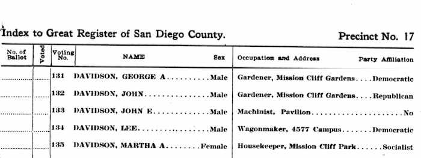
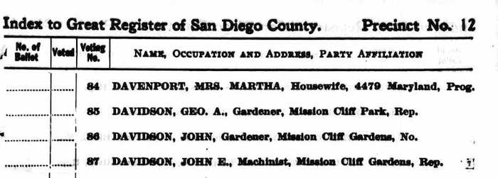
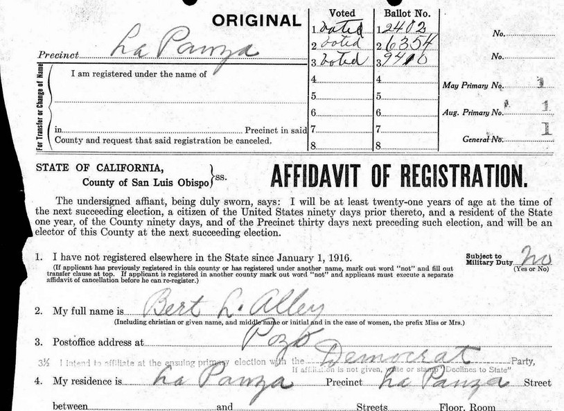
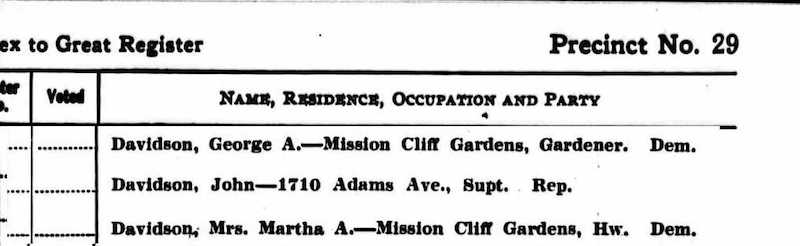
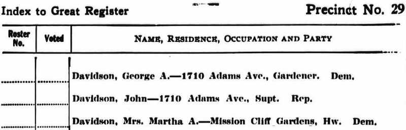

## Realignments

- Critical Realignments were once a common event in American politics

- A major change in the party system occurred about 30 years until 1936

- Beginning in 1936, the party system froze outside the south: Democrats party of labor, Republicans party of business (Lipset & Rokkan, 1967)

- One impediment to broad change: stable partisanship attachments


## Partisans are Loyal to their Party

- In 21st century elections, 90% of Republicans support their party's Presidential candidate

- During Watergate, majority of Republicans supported Nixon (dipped below 50% twice)

- Around 80% of Republicans approve of President Trump's job performance

## Partisanship as Stable Self-Identity

- "However party and religious identifications come about, once they take root in early adulthood, they often persist. Partisan identities are enduring features of citizens’ self-conceptions." (Green, Palmquist & Schickler, 2002)


## The Folk Theory of Partisan Stability

- American political behavior is usually assumed to be time-invariant

- "Extraordinary durability of voting habits" (Key, 1949)

- Implicit in idea of "The Normal Vote" (Converse, 1964)

- "[Absent realignments], as with religion, people are often adherents of a particular political party because their great-grandparents favored it for entirely different reasons" (Achen & Bartels, 2016)

## A Recent Change

- Between 2012 and 2017, 13% of partisans (net) switched from one major party to the other (Voter Study Group)

- In the Pew American Trends panel, 10% of partisans (net) switched

- Switching was concentrated among the young, age was demographic most predictive of switching

## Roadmap

- Show that Partisan Defections were higher Pre-realignment

- Show that demographics weren't predictive of partisanship

- Evaluate whether partisanship is unstable broadly or only among new entrants to the electorate

## My Contributions

- First individual-level dataset covering period before the New Deal

- High levels of partisan instability were the norm from 1908 to 1928

- Social groupings don't explain partisanship (important for theoretical predictions see Mason (2016))

- Classic theories of socialization don't explain heterogeneities in party stability before 1930

- Current instability is structurally different than instability before the New Deal


----


## 1920 Census


## Voter Records - 1912 & 1914


- 

- 


## Data

- California Great Registers, 1908-1968 (today through 1930 only)

- Registers contains 57 million name, address, occupation and party registration records

- California had closed primaries

- Microfilm copies scanned and converted to text by Ancestry.com

- Supplemented with personally identified 1920-1940 census data from the Minnesota Population Center (IPUMS), matched exactly on name and address


## Data

- California Great Registers, 1908-1930

- Registers contains 57 million name, address, occupation and party registration records

- California had closed primaries

- Microfilm copies scanned and converted to text by Ancestry.com

- Supplemented with personally identified 1920-1930 census data from the Minnesota Population Center (IPUMS), matched exactly on name and address

## Why California?

- Only state where clean individual panel data is available at scale

- We know the New Deal realignment happened there, can parse mechanism

- Except for 1924, county-level Presidential vote share similar to rest of non-South

- Literary Digest Polls show Presidential vote switching only 3-5 points higher in California than rest of country (Erikson & Tedin, 1981)


## Why 1908 - 1930?

- Predates scientifically sampled polls

- Window into political behavior under a different party system

- Issues contested were very different

- Post-1936 U.S. party system froze around issues of capital vs labor (Lippset & Rokkan, 1967)

- Maybe freezing of partisanship and axis of policy contestation wasn't mere coincidence

- Group identities were weak, little difference in partisanship by age, gender (See Spahn's Before The American Voter, 2018)

- Small differences by parents' national origin, class


##  Two-Party Consolidation

```{r, cache=T, echo=F, message=F, warning=F}

require(haven)
require(ggplot2)
require(stringr)
require(dplyr)
require(scales)
require(ggthemes)
require(extrafont)
require(ggrepel)

load("other_by_year.RData")
other.by.year <- data.frame(other.by.year) 

other.by.year %>% 
  filter(!party %in% c("Prohibition", "Socialist")) %>% 
  filter(Year %% 2 == 0) %>% 
  #mutate(party = ifelse(party %in% c("Democrat", "Republican"), party, "Other")) %>% 
  group_by(party, Year) %>% 
  dplyr::summarise(pct = sum(pct)) %>% 
  ggplot( aes(x=Year, y = pct, colour = party)) +
  geom_line(size = .8) +
  geom_point(size = 1, show.legend = F) + 
  scale_x_continuous(lim = c(1908, 1930), breaks = seq(1908, 1930, 8)) +
  scale_y_continuous("Share of Registration", labels = percent) +
  #ggtitle("Two-Party Consolidation")+
  #     geom_text_repel(
  #   data = other.by.year %>% filter((Year == 1944 & party %in% c("Democrat", "Republican", "Independent") )|  (Year == 1914 & !party %in% c("Democrat", "Republican", "Independent"))) %>% arrange(party),
  #   aes(label = party),
  #   size = 6,
  #   #nudge_x = c(1.8,3.6,4),
  #   nudge_y= c(0.02, .02, 0, 0, -.02, -.02),
  #   segment.color = NA,
  #   show.legend = F,
  #   family = "Avenir Next"
  # ) +
theme_bw(16) +
  #scale_color_manual("",values = c("#0087ff","#6c71c4","#d70000"))  +
  scale_color_manual("",values = c("#0087ff","#8b8b8b","#00afaf","#d70000"),guide = guide_legend(nrow = 1) )  +
  theme(
    line = element_line(colour = "#E9E9E9"),
    panel.background = element_blank(),
    rect = element_rect(fill = "#E9E9E9"),
    plot.background = element_rect(fill = "#E9E9E9", colour = NA),
    legend.background = element_rect(fill = "#E9E9E9"),
    legend.key = element_rect(fill = "#E9E9E9"),
    
    text = element_text( family = "Avenir Next", color = "#424242"),
    strip.background = element_rect(fill = "#E9E9E9", colour = "#E9E9E9"),
    strip.text = element_text(colour = "#424242",face = "bold", size = 10),
    axis.text = element_text(colour = "#424242"),
    axis.title = element_text(colour = "#424242"),
    
    panel.border=element_rect(colour = NA, fill= NA),
    panel.grid.major.x=element_blank(),
    panel.grid.minor.x=element_blank(),
    panel.grid.major.y = element_line(colour = "#424242", size = .1),
    panel.grid.minor.y = element_blank(),
    
    legend.position="bottom")


```


## Rates of Party Switching

- 2014 - 2016 (major party voters): 10% (Pew, 2017)

- 1992-1996 (major party voters): 4% (ANES, 1997)

- 1965-1973 (major party voters): 6% (Jennings & Niemi, 1973)

- 1908-1928 (major party voters): 10% every four years

- 1920-1930 (major party voters): 16%


## Quadrennial Panel Data

- Match Great Registers to themselves in successive Presidential Years

- Match exactly on Name and Address

- Errs strongly on the side of caution

- Matching errors lead to inflated instability, so minimize instability by matching exactly

- Restricting to non-movers reduces switching rate by 15%

- Exact matching gives nearly identical results to Bayesian probabilistic record linkage (McVeigh, Spahn & Murray, 2018)


## Partisan Stability? {.columns-2}
```{r, cache=T, echo=F, message=F, warning=F, fig.show = "hold", fig.align = "center", fig.width = 4}

require(haven)
require(ggplot2)
require(stringr)
require(dplyr)
require(scales)
require(ggthemes)
require(extrafont)
require(ggrepel)
require(gdata)

load("plot_df_panelchange_with_other.RData")

tmp <- plot.df.panelchange.with.other %>% data.frame %>%  
  filter(year.x == 1924) %>% 
  group_by(party = party.x) %>% 
  summarise(n = sum(n)) %>% 
  ungroup %>% 
  mutate(year = 1924, pct = n/sum(n)) 

tmp <- plot.df.panelchange.with.other %>% data.frame %>% 
  filter(year.x == 1924) %>% 
  group_by(party = party.y) %>% 
  summarise(n = sum(n)) %>% 
  ungroup %>% 
  mutate(year = 1928, pct = n/sum(n)) %>% 
  bind_rows(tmp)

tmp$party <- factor(tmp$party) %>% reorder.factor(new.order = 3:1)


ggplot(tmp, aes(x = factor(year), y = pct, fill = party)) +
  geom_bar(stat="identity", position = "stack", colour = "black", width = .5, size = 0) +
    scale_fill_manual("",values = rev(c("#0087ff","#8b8b8b","#d70000")),guide = guide_legend(nrow = 1) )   +
     scale_x_discrete("", labels = c("1924","1928"), expand = c(0,0)) +
      scale_y_continuous("% of Voters", labels = percent) +  

  theme(legend.position = "none") +
  theme_bw(16) +
  theme(
    line = element_line(colour = "#E9E9E9"),
    panel.background = element_blank(),
    rect = element_rect(fill = "#E9E9E9"),
    plot.background = element_rect(fill = "#E9E9E9", colour = NA),
    legend.background = element_rect(fill = "#E9E9E9"),
    legend.key = element_rect(fill = "#E9E9E9"),
    
    text = element_text( family = "Avenir Next", color = "#424242"),
    strip.background = element_rect(fill = "#E9E9E9", colour = "#E9E9E9"),
    strip.text = element_text(colour = "#424242",face = "bold", size = 10),
    axis.text = element_text(colour = "#424242"),
    axis.title = element_text(colour = "#424242"),
    
    panel.border=element_rect(colour = "#424242", fill= NA),
    panel.grid.major.x=element_blank(),
    panel.grid.minor.x=element_blank(),
    panel.grid.major.y = element_blank(),
    panel.grid.minor.y = element_blank(),
        axis.ticks.x = element_blank(),

    legend.position="none") +
  ggtitle("Marginal Distribution\nof Partisanship")


```

```{r, cache=T, echo=F, message=F, warning=F, fig.show = "hold", fig.align = "center", fig.width = 4}
require(mirt)
require(dplyr)
require(ggparallel)
require(stringr)

load("plot_df_panelchange_with_other.RData")


require(scales)
plot.df.panelchange.with.other %>% data.frame %>% filter(year.x == 1924)  %>% transmute(party.x, party.y, freq = n) %>% as.data.frame %>% 
  expand.table() %>% 
  transmute(party.x = sort(party.x), party.y = sort(party.y)) %>% 
  group_by(party.x,party.y) %>% 
  tally %>% 
  ungroup %>% 
  mutate(pct  = n/ sum(n)) %>% 
  as.data.frame %>% 
  ggparallel(list('party.x', 'party.y'), ., weight = 'pct', order = 0, colour = "black", same.level = T, label = F) + 
      scale_y_continuous("", labels = NULL, breaks = NULL) +  
  scale_fill_manual("",values = rep(c("#0087ff","#8b8b8b","#d70000"),2),guide = guide_legend(nrow = 1) )   +
  scale_colour_manual("",values = rep(c("#0087ff","#8b8b8b","#d70000"),2),guide = guide_legend(nrow = 1) ) + 
    scale_x_discrete("", labels = c("1924","1928"), expand = c(0,0)) +
  theme(legend.position = "none") +
  theme_bw(16) +
  theme(
    line = element_line(colour = "#E9E9E9"),
    panel.background = element_blank(),
    rect = element_rect(fill = "#E9E9E9"),
    plot.background = element_rect(fill = "#E9E9E9", colour = NA),
    legend.background = element_rect(fill = "#E9E9E9"),
    legend.key = element_rect(fill = "#E9E9E9"),
    
    text = element_text( family = "Avenir Next", color = "#424242"),
    strip.background = element_rect(fill = "#E9E9E9", colour = "#E9E9E9"),
    strip.text = element_text(colour = "#424242",face = "bold", size = 10),
    axis.text = element_text(colour = "#424242"),
    axis.title = element_text(colour = "#424242"),
    
    panel.border=element_rect(colour = "#424242", fill= NA),
    panel.grid.major.x=element_blank(),
    panel.grid.minor.x=element_blank(),
    panel.grid.major.y = element_blank(),
    panel.grid.minor.y = element_blank(),
        axis.ticks.x = element_blank(),

    legend.position="none")+
  ggtitle("Hypothetical Minimal (3.5%)\nSwitching of Partisanship")

```


## Partisan Stability? No{.columns-2}
```{r, cache=T, echo=F, message=F, warning=F, fig.show = "hold", fig.align = "center", fig.width = 4}

require(haven)
require(ggplot2)
require(stringr)
require(dplyr)
require(scales)
require(ggthemes)
require(extrafont)
require(ggrepel)
require(gdata)

load("plot_df_panelchange_with_other.RData")

tmp <- plot.df.panelchange.with.other %>% data.frame %>%  
  filter(year.x == 1924) %>% 
  group_by(party = party.x) %>% 
  summarise(n = sum(n)) %>% 
  ungroup %>% 
  mutate(year = 1924, pct = n/sum(n)) 

tmp <- plot.df.panelchange.with.other %>% data.frame %>% 
  filter(year.x == 1924) %>% 
  group_by(party = party.y) %>% 
  summarise(n = sum(n)) %>% 
  ungroup %>% 
  mutate(year = 1928, pct = n/sum(n)) %>% 
  bind_rows(tmp)

tmp$party <- factor(tmp$party) %>% reorder.factor(new.order = 3:1)


ggplot(tmp, aes(x = factor(year), y = pct, fill = party)) +
  geom_bar(stat="identity", position = "stack", colour = "black", width = .5, size = 0) +
    scale_fill_manual("",values = rev(c("#0087ff","#8b8b8b","#d70000")),guide = guide_legend(nrow = 1) )   +
     scale_x_discrete("", labels = c("1924","1928"), expand = c(0,0)) +
      scale_y_continuous("% of Voters", labels = percent) +  

  theme(legend.position = "none") +
  theme_bw(16) +
  theme(
    line = element_line(colour = "#E9E9E9"),
    panel.background = element_blank(),
    rect = element_rect(fill = "#E9E9E9"),
    plot.background = element_rect(fill = "#E9E9E9", colour = NA),
    legend.background = element_rect(fill = "#E9E9E9"),
    legend.key = element_rect(fill = "#E9E9E9"),
    
    text = element_text( family = "Avenir Next", color = "#424242"),
    strip.background = element_rect(fill = "#E9E9E9", colour = "#E9E9E9"),
    strip.text = element_text(colour = "#424242",face = "bold", size = 10),
    axis.text = element_text(colour = "#424242"),
    axis.title = element_text(colour = "#424242"),
    
    panel.border=element_rect(colour = "#424242", fill= NA),
    panel.grid.major.x=element_blank(),
    panel.grid.minor.x=element_blank(),
    panel.grid.major.y = element_blank(),
    panel.grid.minor.y = element_blank(),
        axis.ticks.x = element_blank(),

    legend.position="none")+
  ggtitle("Marginal Distribution\nof Partisanship")


```

```{r, cache=T, echo=F, message=F, warning=F, fig.show = "hold", fig.align = "center", fig.width = 4}

require(dplyr)
require(ggparallel)
require(stringr)

load("plot_df_panelchange_with_other.RData")

# Note overall defection rate is 17%

require(scales)
plot.df.panelchange.with.other %>% data.frame %>% filter(year.x == 1924)  %>% as.data.frame %>% 
  ungroup %>% 
  group_by(year.x) %>% 
  mutate(pct = n / sum(n)) %>% 
  ungroup %>% 
  #transmute(pct,party.x = factor(party.x), party.y = factor(party.y)) %>% 
  as.data.frame %>% 
  ggparallel(list('party.x', 'party.y'), ., weight = 'pct', order = 0, size = .5,colour = "black", same.level = T, label = F) + 
      scale_y_continuous("", labels = NULL, breaks = NULL) +  
  scale_fill_manual("",values = rep(c("#0087ff","#8b8b8b","#d70000"),2),guide = guide_legend(nrow = 1) )   +
  scale_colour_manual("",values = rep(c("#0087ff","#8b8b8b","#d70000"),2),guide = guide_legend(nrow = 1) ) + 
    scale_x_discrete("", labels = c("1924","1928"), expand = c(0,0)) +
  theme(legend.position = "none") +
  theme_bw(16) +
  theme(
    line = element_line(colour = "#E9E9E9"),
    panel.background = element_blank(),
    rect = element_rect(fill = "#E9E9E9"),
    plot.background = element_rect(fill = "#E9E9E9", colour = NA),
    legend.background = element_rect(fill = "#E9E9E9"),
    legend.key = element_rect(fill = "#E9E9E9"),
    
    text = element_text( family = "Avenir Next", color = "#424242"),
    strip.background = element_rect(fill = "#E9E9E9", colour = "#E9E9E9"),
    strip.text = element_text(colour = "#424242",face = "bold", size = 10),
    axis.text = element_text(colour = "#424242"),
    axis.title = element_text(colour = "#424242"),
    
    panel.border=element_rect(colour = "#424242", fill= NA),
    panel.grid.major.x=element_blank(),
    panel.grid.minor.x=element_blank(),
    panel.grid.major.y = element_blank(),
    panel.grid.minor.y = element_blank(),
        axis.ticks.x = element_blank(),

    legend.position="none") +
  ggtitle("Actual (17%) Switching\nof Partisanship")

```


## Partisan Defections {.flexbox .vcenter}

```{r, cache=T, echo=F, message=F, warning=F}


require(haven)
require(ggplot2)
require(stringr)
require(dplyr)
require(scales)
require(ggthemes)
require(extrafont)
require(ggrepel)
require(reshape2)
require(gdata)

load("plot_df_panelchange.RData")
plot.df.panelchange$party.x <- ifelse(str_length(plot.df.panelchange$party.x) > 3, paste0(plot.df.panelchange$party.x,"s"), plot.df.panelchange$party.x)
plot.df.panelchange$source <- "Great Registers"
#tmp <- tibble(year.x = c(1912, 1924, 1928, 1936, 1940), consistent = 1-c(.2, .26, .29,.17, .11), party.x = "All", source = "Polling" )
#plot.df.panelchange <- bind_rows(plot.df.panelchange, tmp)

plot.df.panelchange <- plot.df.panelchange %>% filter(year.x %%4 == 0 ) %>% 
  transmute(year.x, party.x, 
            se = sqrt(consistent * (1-consistent)/n), 
            switch = 1-consistent, 
            num.switch = switch * n,
            n) %>% 
  group_by(year.x) %>% 
  transmute(se, switch, pct.switch = num.switch / sum(n[party.x != "All"]), party.x)

plot.df.panelchange <- melt(plot.df.panelchange, id.vars = c("year.x", "party.x", "se")) %>% filter(party.x != "All" | variable != "pct.switch")
plot.df.panelchange$variable <- ifelse(plot.df.panelchange$variable == "switch", "% of Party", "% of All Two-Party Voters") %>% factor %>%  reorder.factor(new.order = 2:1)

plot.df.panelchange %>% filter(variable  == "% of Party") %>% 
  #filter(year.x > 1932) %>% 
ggplot( aes(x=year.x, y = value, colour = party.x,
                                #linetype = source, 
                                ymin = value-1.96 * se , ymax = 1.96 * se+ value )) +
  geom_line(size = .8) +
  geom_point(size = 1, show.legend = F) +     
  #geom_errorbar(width = 0.2, size = .3, linetype = "solid", show.legend = F) +
  #stat_smooth(se = F) +
  theme_tufte() +
  theme(legend.position = "none") +
  scale_x_continuous("Year of 1st Election",breaks = seq(1908,1924,4), labels = paste0("'",str_pad(string =  seq(08,24,4), side = "left", pad = "0", width = 2)), lim = c(1908,1924)) +
  scale_y_continuous("% Defecting", labels = percent, lim = c(0,.45)) +
  theme_bw(16) +
  #facet_wrap(~variable, ncol = 1, scales = "free_y") +
    #geom_vline(data = expand.grid(x = c(1928,1936), variable = unique(plot.df.panelchange$variable)), aes(xintercept = x), linetype = "dashed", size = .3) +

  #ggtitle("Partisan Stability Among Major-Party Registrants") +
  scale_color_manual("",values = c("#424242","#0087ff","#d70000"))  +
  #scale_alpha_manual("", values = c(1,.5,.3))+
  scale_linetype("") +
  theme(
    line = element_line(colour = "#E9E9E9"),
    panel.background = element_blank(),
    rect = element_rect(fill = "#E9E9E9"),
    plot.background = element_rect(fill = "#E9E9E9", colour = NA),
    legend.background = element_rect(fill = "#E9E9E9"),
    legend.key = element_rect(fill = "#E9E9E9"),
    
    text = element_text( family = "Avenir Next", color = "#424242"),
    strip.background = element_rect(fill = "#E9E9E9", colour = "#E9E9E9"),
    strip.text = element_text(colour = "#424242",face = "bold", size = 10),
    axis.text = element_text(colour = "#424242"),
    axis.title = element_text(colour = "#424242"),
    
    panel.border=element_rect(colour = NA, fill= NA),
    panel.grid.major.x=element_blank(),
    panel.grid.minor.x=element_blank(),
    panel.grid.major.y = element_line(colour = "#424242", size = .1),
    panel.grid.minor.y = element_blank(),
    
    legend.position="bottom")


```


## Party by Gender {.flexbox .vcenter}

```{r, cache=T, echo=F, message=F, warning=F}
require(haven)
require(ggplot2)
require(stringr)
require(dplyr)
require(scales)
require(ggthemes)
load("~/Downloads/Presentation Files/partisanship_by_yearsex.RData")


partisanship.by.year.sex %>% data.frame %>% 
  filter(Year %% 2 == 0 & !is.na(sex) & n > 10000) %>% 
  mutate(gender = ifelse(sex == "M", "Men", "Women")) %>% 
  ggplot( aes(x=Year, y = pct.dem, colour = gender)) +
  geom_line() +
  geom_point() +
  scale_x_continuous(lim = c(1908, 1944), breaks = seq(1908, 1944, 8)) +
  scale_y_continuous("Dem Share", labels = percent, lim = c(0,.70)) +
  theme_bw(16) +
  scale_color_manual("", values = c("#0087ff", "#d33682"))  +
  theme(
    line = element_line(colour = "#E9E9E9"),
    panel.background = element_blank(),
    rect = element_rect(fill = "#E9E9E9"),
    plot.background = element_rect(fill = "#E9E9E9", colour = NA),
    legend.background = element_rect(fill = "#E9E9E9"),
    legend.key = element_rect(fill = "#E9E9E9"),
    
    text = element_text( family = "Avenir Next", color = "#424242"),
    strip.background = element_rect(fill = "#E9E9E9", colour = "#E9E9E9"),
    strip.text = element_text(colour = "#424242",face = "bold", size = 10),
    axis.text = element_text(colour = "#424242"),
    axis.title = element_text(colour = "#424242"),
    
    panel.border=element_rect(colour = NA, fill= NA),
    panel.grid.major.x=element_blank(),
    panel.grid.minor.x=element_blank(),
    panel.grid.major.y = element_line(colour = "#424242"),
    panel.grid.minor.y = element_blank(),
    legend.position="bottom")

```


## Party by Age {.flexbox .vcenter}


```{r, cache=T, echo=F, message=F, warning=F}

require(haven)
require(ggplot2)
require(stringr)
require(dplyr)
require(scales)
require(ggthemes)
require(ggrepel)

load("partisanship_by_age.RData")
partisanship.by.age <- partisanship.by.age %>% mutate(birthyear = year-age) %>%   mutate(age.in.1920 = 1920 - birthyear) 

partisanship.by.age %>% 
  filter(n > 100 & age >= 20) %>% 
  mutate(age.in.1920 = 1920 - birthyear) %>% 
  ggplot( aes(x=age.in.1920, y = pct.dem, colour = factor(year))) +
  stat_smooth(se = F)+
  geom_point(size = .8) +
  scale_x_continuous("Age in 1920") +
  scale_y_continuous("Two-Way Dem Share", labels = percent, lim  = c(0,.6)) +
  theme_bw(16) +
  scale_color_manual("",values = c("#8b8b8b", "#77ab43", "#820000"))  +
  geom_text_repel(
    data = partisanship.by.age %>% group_by(year) %>% filter(n > 100) %>% filter(birthyear == max(birthyear)) %>% arrange(year),
    aes(label = factor(year)),
    size = 6,
    nudge_x = c(1, 1, 0),
    nudge_y= c(-.03, 0.03, .00),
    segment.color = NA,
    show.legend = F,
    family = "Avenir Next"
  ) +
  theme(
    line = element_line(colour = "#E9E9E9"),
    panel.background = element_blank(),
    rect = element_rect(fill = "#E9E9E9"),
    plot.background = element_rect(fill = "#E9E9E9", colour = NA),
    legend.background = element_rect(fill = "#E9E9E9"),
    legend.key = element_rect(fill = "#E9E9E9"),
    
    text = element_text( family = "Avenir Next", color = "#424242"),
    strip.background = element_rect(fill = "#E9E9E9", colour = "#E9E9E9"),
    strip.text = element_text(colour = "#424242",face = "bold", size = 10),
    axis.text = element_text(colour = "#424242"),
    axis.title = element_text(colour = "#424242"),
    
    panel.border=element_rect(colour = NA, fill= NA),
    panel.grid.major.x=element_blank(),
    panel.grid.minor.x=element_blank(),
    panel.grid.major.y = element_line(colour = "#424242", size = .1),
    panel.grid.minor.y = element_blank(),
    
    legend.position="none")

```


## Implications of Socialization Theory

Need to test if high rate of party switching is compositional or broad-based. Socialization theory says...

- People with more experience voting for a party should be more stable (partisan habituation)

- Older people should be more stable (longer period of socialization)

- Voters just coming of age should be especially unstable (generational model, Ghitza & Gelman, 2014)

## Women

- California Women first voted in 1912

- Claim: because parents didn't expect them to vote, would have gotten less partisan socialization from parents (Andersen, 1979)

- Conventional prediction: less partisan socialization would lead to more instability, voters "not immunized" to political forces by childhood partisan socialization

- Claim in literature: Women contributed to new deal realignment by converting to Democratic Party more often than men (Corder & Wolbrecht, 2016)

- Women's registration rate about 75% of men's

- Matching process excludes women that change their name

## Party Switching By Gender {.flexbox .vcenter}

```{r, cache=T, echo=F, message=F, warning=F}


require(haven)
require(ggplot2)
require(stringr)
require(dplyr)
require(scales)
require(ggthemes)
require(extrafont)
require(ggrepel)
require(reshape2)
require(gdata)

load("~/Downloads/plot_df_panelchange_by_sex.RData")
plot.df.panelchange.by.sex$party.x <- ifelse(str_length(plot.df.panelchange.by.sex$party.x) > 3, paste0(plot.df.panelchange.by.sex$party.x,"s"), plot.df.panelchange.by.sex$party.x)
plot.df.panelchange.by.sex$source <- "Great Registers"
#tmp <- tibble(year.x = c(1912, 1924, 1936, 1940), consistent = 1-c(.2, .26, .17, .11), party.x = "All", source = "Polling" )
#plot.df.panelchange <- bind_rows(plot.df.panelchange, tmp)

plot.df.panelchange.by.sex <- plot.df.panelchange.by.sex %>% ungroup %>% filter(year.x %%4 == 0 ) %>% 
  mutate(year.x, party.x, 
            se = sqrt(consistent * (1-consistent)/n), 
            switch = 1-consistent, 
            num.switch = switch * n,
            n) %>% 
    mutate(gender = ifelse(sex.x == "M", "Men", "Women")) #%>%   filter(party.x != "All")


plot.df.panelchange.by.sex %>% 
  filter(party.x == "All") %>% 
ggplot( aes(x=year.x, y = switch,linetype = gender#, colour = party.x, 
                                #linetype = source, 
                                )) +
  geom_line(size = .8) +
  geom_point(size = 1, show.legend = F) +     
  #geom_errorbar(width = 0.2, size = .3, linetype = "solid", show.legend = F) +
  #stat_smooth(se = F) +
  theme_tufte() +
  theme(legend.position = "none") +
  scale_x_continuous("Year of 1st Election",breaks = seq(1908,1960,4), labels = paste0("'",str_pad(string =  seq(08,60,4), side = "left", pad = "0", width = 2)), lim = c(1912,1924)) +
  scale_y_continuous("% Switching", labels = percent, lim = c(0,NA)) +
  theme_bw(16) +
    #geom_vline(xintercept = c(1928,1936), linetype = "dashed", size = .3) +

  #ggtitle("Partisan Stability Among Major-Party Registrants") +
  scale_color_manual("",values = c("#778899","#0087ff","#d70000"))  +
  #scale_alpha_manual("", values = c(1,.5,.3))+
  scale_linetype_manual("", values = c("dotted", "solid") )+
  theme(
    line = element_line(colour = "#E9E9E9"),
    panel.background = element_blank(),
    rect = element_rect(fill = "#E9E9E9"),
    plot.background = element_rect(fill = "#E9E9E9", colour = NA),
    legend.background = element_rect(fill = "#E9E9E9"),
    legend.key = element_rect(fill = "#E9E9E9"),
    
    text = element_text( family = "Avenir Next", color = "#424242"),
    strip.background = element_rect(fill = "#E9E9E9", colour = "#E9E9E9"),
    strip.text = element_text(colour = "#424242",face = "bold", size = 10),
    axis.text = element_text(colour = "#424242"),
    axis.title = element_text(colour = "#424242"),
    
    panel.border=element_rect(colour = NA, fill= NA),
    panel.grid.major.x=element_blank(),
    panel.grid.minor.x=element_blank(),
    panel.grid.major.y = element_line(colour = "#424242", size = .1),
    panel.grid.minor.y = element_blank(),
    
    legend.position="bottom")


```

## Party Switching By Age - 1920-30

Party Switching Rates for Native-Born Americans:

- 10% (1916 - 1920)
- 14% (1920 - 1924)

Party Switching Rates for Foreign-Born Americans:

- 14% (1916 - 1920)
- 18% (1920 - 1924)

## Party Switching By Age - 1920-30

```{r, cache=T, echo=F, message=F, warning=F}

require(haven)
require(ggplot2)
require(stringr)
require(dplyr)
require(scales)
require(ggthemes)
require(extrafont)
require(ggrepel)
require(reshape2)
require(gdata)
require(Hmisc)


load("switching_by_age.RData")

anes.9296 <- read_dta("~/Downloads/anes_mergedfile_1992to1997_dta/anes_mergedfile_1992to1997.dta") %>% 
  transmute( pidx = V923634,
pidy = V960420,
Age = V923903,
period = "1992-1996")

anes.7276 <- read_dta("~/Downloads/anes_mergedfile_1972to1976_dta/anes_mergedfile_1972to1976.dta") %>% 
  transmute( pidx = V720140,
             pidy = V763174,
             Age = V720294,
             period = "1972-1976")


anes.panel <- bind_rows(anes.7276, anes.9296)

anes.panel <- anes.panel %>%
  filter(pidx %in% c(0,1,5,6) & pidy %in% c(0,1,5,6)) %>% 
  #filter((V925602 %in% 0:1 | is.na(V925602)) & (V961075 %in% 0:1 | is.na(V961075))) %>% 
  mutate(pidx.2 = case_when(pidx %in% 0:1 ~"Dem", pidx %in% 5:6 ~ "Rep", T ~"Other"),
           pidy.2 = case_when(pidy %in% 0:1 ~"Dem", pidy %in% 5:6 ~ "Rep", T ~"Other"),
         switch = as.numeric(pidx.2 != pidy.2))

anes.panel.pts <- anes.panel %>% 
  group_by(Age,period) %>% 
  summarise(switch = mean(switch, na.rm=T), N = n())
  
switching.by.age$period <- paste(switching.by.age$year.x, switching.by.age$year.y, sep = "-" )

switching.by.age.pts <- switching.by.age %>% 
  mutate(Age = age) %>% 
  group_by(Age, period) %>% 
  dplyr::summarise(switch = mean(party.x != party.y), N= n())

switching.by.age$switch <- as.numeric(switching.by.age$party.x != switching.by.age$party.y)
switching.by.age$Age <- switching.by.age$age


load("atp_switching.RData")

atp.switch<- atp.switch %>% 
  filter(partysum_w23 %in% c(1,2) & f_partysum_typology %in% 1:2  ) %>%
  transmute(switch, period = "2014-2016", Age = age.x, weight = weight_w1 )

atp.switch.pts <- atp.switch %>% 
  group_by(Age, period) %>% summarise(N = sum(!is.na(weight)), switch = wtd.mean(switch,weights = weight, na.rm=T))
  

switching.by.age <- bind_rows(switching.by.age, atp.switch,anes.panel) %>% 
  mutate(weight = coalesce(weight, 1))
switching.by.age.pts <- bind_rows(switching.by.age.pts, atp.switch.pts, anes.panel.pts) %>% mutate(weight = 1) %>% ungroup %>% 
  group_by(Age = floor(Age/5) * 5 + 2.5, period,weight) %>% 
  summarise(switch = wtd.mean(switch, N), N = sum(N))

periods.to.ignore <- c("1930-1940", "1972-1976")


switching.by.age %>% 
  filter(! period %in% periods.to.ignore  & Age >= 20 & Age <= 70 & !is.na(switch) ) %>% 
  mutate(anes = ifelse(period %in% c("1972-1976", "1992-1996"), "Stable Period", "Unstable Period")) %>% 
ggplot( aes(x=Age, y = switch, colour = period,  weight = weight )) +
 geom_point(data = 
               switching.by.age.pts %>% 
              mutate(anes = ifelse(period %in% c("1972-1976", "1992-1996"), "Stable Period", "Unstable Period")) %>%  
  filter(! period %in% periods.to.ignore  & Age >= 20 & Age <= 70 & !is.na(switch) ), 
             show.legend = T) +     
  #facet_grid(~ anes) +
  stat_smooth(se = T, method= "lm", show.legend = F ) +
  theme_bw(16) +
  scale_x_continuous("Age in 1920", lim = c(20,60))+
    scale_y_continuous("% Switching", labels = percent, lim = c(NA,NA)) +
  #facet_wrap(~party.x, ncol = 1) +
  #ggtitle("Partisan Stability Among Major-Party Registrants") +
  scale_color_manual("",values = c("#5f8700","#6c71c4","#d70000","#0087ff"))  +
  #scale_alpha_manual("", values = c(1,.5,.3))+
  scale_linetype("") +
  theme(
    line = element_line(colour = "#E9E9E9"),
    panel.background = element_blank(),
    rect = element_rect(fill = "#E9E9E9"),
    plot.background = element_rect(fill = "#E9E9E9", colour = NA),
    legend.background = element_rect(fill = "#E9E9E9"),
    legend.key = element_rect(fill = "#E9E9E9"),
    
    text = element_text( family = "Avenir Next", color = "#424242"),
    strip.background = element_rect(fill = "#E9E9E9", colour = "#E9E9E9"),
    strip.text = element_text(colour = "#424242",face = "bold", size = 10),
    axis.text = element_text(colour = "#424242"),
    axis.title = element_text(colour = "#424242"),
    
    panel.border=element_rect(colour = NA, fill= NA),
    panel.grid.major.x=element_blank(),
    panel.grid.minor.x=element_blank(),
    panel.grid.major.y = element_line(colour = "#424242"),
    panel.grid.minor.y = element_blank(),
    
    legend.position="bottom")

```


## Party By Age (again)

```{r, cache=T, echo=F, message=F, warning=F}

load("~/Downloads/Presentation Files/partisanship_by_age.RData")

load("atp_switching.RData")


partisanship.by.age <- partisanship.by.age %>% mutate(birthyear = year-age)

modern.by.age <- atp.switch %>% filter(partysum_w23 %in% 1:2) %>% group_by(age = age.y) %>% summarise(pct.dem = mean(f_partysum_typology == 2), n =n(), year = 2014)

partisanship.by.age <- partisanship.by.age %>% 
    filter(n > 10 & age >= 20 & year != 1940 & year != 2014) %>% 
  bind_rows(modern.by.age)

  ggplot(partisanship.by.age, aes(x=age, y = pct.dem, colour = factor(year))) +
  stat_smooth(se = F)+
  geom_point(size = .8) +
  scale_x_continuous("Age", breaks = seq(20, 80, 20), lim = c(20,80)) +
  scale_y_continuous("Dem Share", labels = percent) +
  #facet_grid(~ anes) +
  theme_bw(16) +
  #facet_wrap(~party.x, ncol = 1) +
  #ggtitle("Partisan Stability Among Major-Party Registrants") +
  scale_color_manual("",values = c("#5f8700","#6c71c4","#d70000"))  +
  #scale_alpha_manual("", values = c(1,.5,.3))+
  scale_linetype("") +
  theme(
    line = element_line(colour = "#E9E9E9"),
    panel.background = element_blank(),
    rect = element_rect(fill = "#E9E9E9"),
    plot.background = element_rect(fill = "#E9E9E9", colour = NA),
    legend.background = element_rect(fill = "#E9E9E9"),
    legend.key = element_rect(fill = "#E9E9E9"),
    
    text = element_text( family = "Avenir Next", color = "#424242"),
    strip.background = element_rect(fill = "#E9E9E9", colour = "#E9E9E9"),
    strip.text = element_text(colour = "#424242",face = "bold", size = 10),
    axis.text = element_text(colour = "#424242"),
    axis.title = element_text(colour = "#424242"),
    
    panel.border=element_rect(colour = NA, fill= NA),
    panel.grid.major.x=element_blank(),
    panel.grid.minor.x=element_blank(),
    panel.grid.major.y = element_line(colour = "#424242"),
    panel.grid.minor.y = element_blank(),
    
    legend.position="bottom")

```


## Summary of Socialization Results


- Except for modest age effects, little heterogeneity in switching pre-realignment

- Socialization is less important in partisan attchments pre-1930

- Perhaps most and least experienced voters switch parties for similar reasons

- Non-socialized attachments may be in play

- The fact that identities aren't differentiated in partisan may contribute to weak attachments (Mason, 2016)


## Generational Distinctiveness

- Generational Replacement has replaced realignment as the engine of political change

- High rates of switching by young people is consistent with the formation of political generations (Ghitza & Gelman, 2014)

- Before 1930, little partisan differentiation by age

- Present day: older voters are most Republican, declining as share of voters

- Present day: youngest voters are most Democratic, rising as share of electorate


## Conclusions

- New data makes historical political behavior tractable

- Individual partisanship less stable before 1928

- Instability was hidden by stable macropartisanship

- Present era of partisan stability began after New Deal realignment

- Folk theory doesn't hold pre-realignment

- Present instability is different than pre-realignment, concentrated among the young

- Barring broad instability, critical realignment seems unlikely


# Auxiliary Slides

## Ongoing Research

- Family socialization and gender dynamics with Shanto Iyengar

- 100 years of partisan geographic sorting with Jonathan Rodden & Shanto Iyengar

- Decompose the New Deal realignment into component sources of change: conversion, mobilization, migration (conversion accounts for almost all of it)


## The Form



## Voter Records - 1932 & 1934


- 

- 


## California as a representative case {.flexbox .vcenter}

```{r, cache=T, echo=F, message=F, warning=F}

require(haven)
require(ggplot2)
require(stringr)
require(dplyr)
require(scales)
require(ggthemes)
jr <- read_dta("counties_brad.dta")
south <- c('Alabama',	'Arkansas',	'Florida',	'Georgia',	'Kentucky',	'Louisiana',	'Mississippi',	'North Carolina',	'South Carolina',	'Tennessee',	'Texas',	'Virginia',	'West Virginia')
colnames(jr) <- tolower(colnames(jr))

jr$is.california <- ifelse(jr$statenam == "California", "California", "Other Non-South")

by.county <- jr %>% filter(!statenam %in% south & year %in% 1908:1928) %>% group_by(year,statenam,county,is.california) %>% 
  dplyr::summarise(d = sum(dv)/sum(tot))

ggplot(by.county, aes(x=d, colour = is.california)) + 
  geom_line( stat = "density") +
  scale_x_continuous("County-Level Democratic Presidential Vote Share", labels = percent, lim = c(0,.9)) + 
  scale_y_continuous("", breaks = NULL) +
  scale_color_manual("",values = c("#FF5959", "#424242"))  +
  theme_bw(16) +
  facet_wrap(~year, scales = "free_y") +
  theme(
    line = element_line(colour = "#E9E9E9"),
    panel.background = element_blank(),
    rect = element_rect(fill = "#E9E9E9"),
    plot.background = element_rect(fill = "#E9E9E9", colour = NA),
    legend.background = element_rect(fill = "#E9E9E9"),
    legend.key = element_rect(fill = "#E9E9E9"),
    
    text = element_text( family = "Avenir Next", color = "#424242"),
    strip.background = element_rect(fill = "#E9E9E9", colour = "#E9E9E9"),
    strip.text = element_text(colour = "#424242",face = "bold", size = 10),
    axis.text = element_text(colour = "#424242"),
    axis.title = element_text(colour = "#424242"),
    
    panel.border=element_rect(colour = "#424242", fill= NA),
    panel.grid.major.x=element_blank(),
    panel.grid.minor.x=element_blank(),
    panel.grid.major.y = element_line(colour = "#424242"),
    panel.grid.minor.y = element_line(colour = "#424242"),
    
    legend.position="bottom")


```


## Registration vs. Vote Choice {.flexbox .vcenter}

```{r, cache=T, echo=F, message=F, warning=F}

require(extrafont)

require(haven)
require(ggplot2)
require(stringr)
require(dplyr)
require(scales)
require(ggthemes)
require(reshape2)


load("~/Downloads/Presentation Files/by_county_presvote.RData")
load("~/Downloads/Presentation Files/by_county_turnout.RData")


statewide <- data.frame(by.county) %>% inner_join(data.frame(by.county.turnout)) %>% 
  group_by(year) %>% 
  dplyr::summarise(d = sum(tot * d) / sum(tot), demreg = sum(n * demreg) / sum(n))


by.county.plot <- melt(by.county, id.vars = c( "year", "county"))


by.county.plot$var2 <- case_when(by.county.plot$variable == "d" ~ "Presidential Vote",
                                 by.county.plot$variable == "demreg" ~ "Party Registration")

by.county.plot %>% 
  group_by(county) %>% 
  filter(min(year) < 1930 & max(year) > 1936) %>% 
  ungroup %>% 
  mutate(year = year - 1900) %>% 
  ggplot( aes(x=year, y = value,  linetype = var2)) + 
  geom_line()+
  geom_point(size = .5) +
  theme_bw(16) +
  facet_wrap(~county, nrow = 3) + 
  scale_y_continuous("Two-Way Dem Share", labels = percent, expand = c(0,0), lim = c(0,.8)) +
  scale_x_continuous("Year", lim = c(12,44), breaks = seq(12,44,8), labels = paste0("'", seq(12,44,8))) +
  ggtitle("Registration and Presidential Vote") +
  #scale_color_manual("",values = c("#820000", "#585754"))  +
  scale_linetype_manual("", values = c("solid", "dotted")) + 
  theme(
    line = element_line(colour = "#E9E9E9"),
    panel.background = element_blank(),
    rect = element_rect(fill = "#E9E9E9"),
    plot.background = element_rect(fill = "#E9E9E9", colour = NA),
    legend.background = element_rect(fill = "#E9E9E9"),
    legend.key = element_rect(fill = "#E9E9E9"),
    
    text = element_text( family = "Avenir Next", color = "#424242"),
    strip.background = element_rect(fill = "#E9E9E9", colour = "#E9E9E9"),
    strip.text = element_text(colour = "#424242",face = "bold", size = 10),
    axis.text = element_text(colour = "#424242"),
    axis.title = element_text(colour = "#424242"),
    
    panel.border=element_rect(colour = "#424242", fill= NA),
    panel.grid.major.x=element_blank(),
    panel.grid.minor.x=element_blank(),
    panel.grid.major.y=element_blank(),
    panel.grid.minor.y=element_blank(),
    #panel.grid.major.y = element_line(colour = "#424242"),
    #panel.grid.minor.y = element_line(colour = "#424242"),
    
    legend.position="bottom")


```


##  Two-Party Consolidation

```{r, cache=T, echo=F, message=F, warning=F}

require(haven)
require(ggplot2)
require(stringr)
require(dplyr)
require(scales)
require(ggthemes)
require(extrafont)
require(ggrepel)

load("other_by_year.RData")
other.by.year <- data.frame(other.by.year) 

other.by.year %>% 
  filter(!party %in% c("Prohibition", "Socialist")) %>% 
  filter(Year %% 2 == 0) %>% 
  #mutate(party = ifelse(party %in% c("Democrat", "Republican"), party, "Other")) %>% 
  group_by(party, Year) %>% 
  dplyr::summarise(pct = sum(pct)) %>% 
  ggplot( aes(x=Year, y = pct, colour = party)) +
  geom_line(size = .8) +
  geom_point(size = 1, show.legend = F) + 
  scale_x_continuous(lim = c(1908, 1944), breaks = seq(1908, 1944, 8)) +
  scale_y_continuous("Share of Registration", labels = percent) +
  #ggtitle("Two-Party Consolidation")+
  #     geom_text_repel(
  #   data = other.by.year %>% filter((Year == 1944 & party %in% c("Democrat", "Republican", "Independent") )|  (Year == 1914 & !party %in% c("Democrat", "Republican", "Independent"))) %>% arrange(party),
  #   aes(label = party),
  #   size = 6,
  #   #nudge_x = c(1.8,3.6,4),
  #   nudge_y= c(0.02, .02, 0, 0, -.02, -.02),
  #   segment.color = NA,
  #   show.legend = F,
  #   family = "Avenir Next"
  # ) +
theme_bw(16) +
  #scale_color_manual("",values = c("#0087ff","#6c71c4","#d70000"))  +
  scale_color_manual("",values = c("#0087ff","#8b8b8b","#00afaf","#d70000"),guide = guide_legend(nrow = 1) )  +
  theme(
    line = element_line(colour = "#E9E9E9"),
    panel.background = element_blank(),
    rect = element_rect(fill = "#E9E9E9"),
    plot.background = element_rect(fill = "#E9E9E9", colour = NA),
    legend.background = element_rect(fill = "#E9E9E9"),
    legend.key = element_rect(fill = "#E9E9E9"),
    
    text = element_text( family = "Avenir Next", color = "#424242"),
    strip.background = element_rect(fill = "#E9E9E9", colour = "#E9E9E9"),
    strip.text = element_text(colour = "#424242",face = "bold", size = 10),
    axis.text = element_text(colour = "#424242"),
    axis.title = element_text(colour = "#424242"),
    
    panel.border=element_rect(colour = NA, fill= NA),
    panel.grid.major.x=element_blank(),
    panel.grid.minor.x=element_blank(),
    panel.grid.major.y = element_line(colour = "#424242", size = .1),
    panel.grid.minor.y = element_blank(),
    
    legend.position="bottom")


```


##  Two-Party Consolidation

```{r, cache=T, echo=F, message=F, warning=F}

require(haven)
require(ggplot2)
require(stringr)
require(dplyr)
require(scales)
require(ggthemes)
require(extrafont)
require(ggrepel)

load("other_by_year.RData")
other.by.year <- data.frame(other.by.year) 

other.by.year %>% 
  filter(!party %in% c("Prohibition", "Socialist")) %>% 
  filter(Year %% 2 == 0) %>% 
  #mutate(party = ifelse(party %in% c("Democrat", "Republican"), party, "Other")) %>% 
  group_by(party, Year) %>% 
  dplyr::summarise(pct = sum(pct)) %>% 
  ggplot( aes(x=Year, y = pct, colour = party)) +
  geom_line(size = .8) +
  geom_point(size = 1, show.legend = F) + 
  scale_x_continuous(lim = c(1908, 1944), breaks = seq(1908, 1944, 8)) +
  scale_y_continuous("Share of Registration", labels = percent) +
  #ggtitle("Two-Party Consolidation")+
  #     geom_text_repel(
  #   data = other.by.year %>% filter((Year == 1944 & party %in% c("Democrat", "Republican", "Independent") )|  (Year == 1914 & !party %in% c("Democrat", "Republican", "Independent"))) %>% arrange(party),
  #   aes(label = party),
  #   size = 6,
  #   #nudge_x = c(1.8,3.6,4),
  #   nudge_y= c(0.02, .02, 0, 0, -.02, -.02),
  #   segment.color = NA,
  #   show.legend = F,
  #   family = "Avenir Next"
  # ) +
theme_bw(16) +
  #scale_color_manual("",values = c("#0087ff","#6c71c4","#d70000"))  +
  scale_color_manual("",values = c("#0087ff","#8b8b8b","#00afaf","#d70000"),guide = guide_legend(nrow = 1) )  +
  theme(
    line = element_line(colour = "#E9E9E9"),
    panel.background = element_blank(),
    rect = element_rect(fill = "#E9E9E9"),
    plot.background = element_rect(fill = "#E9E9E9", colour = NA),
    legend.background = element_rect(fill = "#E9E9E9"),
    legend.key = element_rect(fill = "#E9E9E9"),
    
    text = element_text( family = "Avenir Next", color = "#424242"),
    strip.background = element_rect(fill = "#E9E9E9", colour = "#E9E9E9"),
    strip.text = element_text(colour = "#424242",face = "bold", size = 10),
    axis.text = element_text(colour = "#424242"),
    axis.title = element_text(colour = "#424242"),
    
    panel.border=element_rect(colour = NA, fill= NA),
    panel.grid.major.x=element_blank(),
    panel.grid.minor.x=element_blank(),
    panel.grid.major.y = element_line(colour = "#424242", size = .1),
    panel.grid.minor.y = element_blank(),
    
    legend.position="bottom")


```


## Census Matching

- Match 1920 and 1930 censuses exactly to Great Registers of same year

- Use fastlink (Enamorado et al) to match 1920 to 1930 census

- Match censuses on first, last, street name, age, occupation and place of birth of mother, father and self

- Use only matches with probability of matching > .995


## Defections by County


```{r, cache=T, echo=F, message=F, warning=F}

require(haven)
require(ggplot2)
require(stringr)
require(dplyr)
require(scales)
require(ggthemes)
require(extrafont)
require(ggrepel)
require(reshape2)
require(gdata)

load("plot_df_panelchange_by_county.RData")
plot.df.panelchange.by.county$party.x <- ifelse(str_length(plot.df.panelchange.by.county$party.x) > 3, paste0(plot.df.panelchange.by.county$party.x,"s"), plot.df.panelchange.by.county$party.x)
plot.df.panelchange.by.county$source <- "Great Registers"
#tmp <- tibble(year.x = c(1912, 1924, 1928, 1936, 1940), consistent = 1-c(.2, .26, .29,.17, .11), party.x = "All", source = "Polling" )
#plot.df.panelchange <- bind_rows(plot.df.panelchange, tmp)

plot.df.panelchange.by.county <- plot.df.panelchange.by.county %>% ungroup %>% filter(year.x %%4 == 0 & n > 200) %>% 
  transmute(year.x, party.x, county,
            se = sqrt(consistent * (1-consistent)/n), 
            switch = 1-consistent, 
            num.switch = switch * n,
            n) %>% 
  group_by(year.x, county) %>% 
  transmute(se, switch, pct.switch = num.switch / sum(n[party.x != "All"]), party.x, n)

plot.df.panelchange.by.county <- melt(plot.df.panelchange.by.county, id.vars = c("year.x", "party.x", "se", "county")) %>% filter(party.x != "All" | variable != "pct.switch")
plot.df.panelchange.by.county$variable <- ifelse(plot.df.panelchange.by.county$variable == "switch", "% of Party", "% of All Two-Party Voters") %>% factor %>%  reorder.factor(new.order = 2:1)


plot.df.panelchange.by.county %>% 
  filter(variable == "% of Party") %>% 
ggplot( aes(x=year.x, y = value, colour = party.x, group = factor(county),
                                #linetype = source, 
                                ymin = value-1.96 * se , ymax = 1.96 * se+ value )) +
  geom_line(size = .8, alpha = .4) +
  #geom_point(size = 1, show.legend = F, alpha = .4) +     
  #geom_errorbar(width = 0.2, size = .3, linetype = "solid", show.legend = F) +
  #stat_smooth(se = F) +
  theme_tufte() +
  theme(legend.position = "none") +
  scale_x_continuous("Year of 1st Election",breaks = seq(1908,1960,4), labels = paste0("'",str_pad(string =  seq(08,60,4), side = "left", pad = "0", width = 2))) +
  scale_y_continuous("% Defecting", labels = percent, lim = c(0,NA)) +
  theme_bw(16) +
    #geom_vline(data = expand.grid(x = c(1928,1936), variable = unique(plot.df.panelchange$variable)), aes(xintercept = x), linetype = "dashed", size = .3) +
  facet_wrap(~party.x, nrow = 3, scales = "free_y") +

  #ggtitle("Partisan Stability Among Major-Party Registrants") +
  scale_color_manual("",values = c("#424242","#0087ff","#d70000"))  +
  #scale_alpha_manual("", values = c(1,.5,.3))+
  scale_linetype("") +
  theme(
    line = element_line(colour = "#E9E9E9"),
    panel.background = element_blank(),
    rect = element_rect(fill = "#E9E9E9"),
    plot.background = element_rect(fill = "#E9E9E9", colour = NA),
    legend.background = element_rect(fill = "#E9E9E9"),
    legend.key = element_rect(fill = "#E9E9E9"),
    
    text = element_text( family = "Avenir Next", color = "#424242"),
    strip.background = element_rect(fill = "#E9E9E9", colour = "#E9E9E9"),
    strip.text = element_text(colour = "#424242",face = "bold", size = 10),
    axis.text = element_text(colour = "#424242"),
    axis.title = element_text(colour = "#424242"),
    
    panel.border=element_rect(colour = NA, fill= NA),
    panel.grid.major.x=element_blank(),
    panel.grid.minor.x=element_blank(),
    panel.grid.major.y = element_line(colour = "#424242", size = .1),
    panel.grid.minor.y = element_blank(),
    
    legend.position="bottom")


```

## Defections in San Francisco


```{r, cache=T, echo=F, message=F, warning=F}

require(haven)
require(ggplot2)
require(stringr)
require(dplyr)
require(scales)
require(ggthemes)
require(extrafont)
require(ggrepel)
require(reshape2)
require(gdata)

load("plot_df_panelchange_by_county.RData")
plot.df.panelchange.by.county$party.x <- ifelse(str_length(plot.df.panelchange.by.county$party.x) > 3, paste0(plot.df.panelchange.by.county$party.x,"s"), plot.df.panelchange.by.county$party.x)
plot.df.panelchange.by.county$source <- "Great Registers"
#tmp <- tibble(year.x = c(1912, 1924, 1928, 1936, 1940), consistent = 1-c(.2, .26, .29,.17, .11), party.x = "All", source = "Polling" )
#plot.df.panelchange <- bind_rows(plot.df.panelchange, tmp)

plot.df.panelchange.by.county <- plot.df.panelchange.by.county %>% ungroup %>% filter(year.x %%4 == 0 & n > 200) %>% 
  transmute(year.x, party.x, county,
            se = sqrt(consistent * (1-consistent)/n), 
            switch = 1-consistent, 
            num.switch = switch * n,
            n) %>% 
  group_by(year.x, county) %>% 
  transmute(se, switch, pct.switch = num.switch / sum(n[party.x != "All"]), party.x, n)

plot.df.panelchange.by.county <- melt(plot.df.panelchange.by.county, id.vars = c("year.x", "party.x", "se", "county")) %>% filter(party.x != "All" | variable != "pct.switch")
plot.df.panelchange.by.county$variable <- ifelse(plot.df.panelchange.by.county$variable == "switch", "% of Party", "% of All Two-Party Voters") %>% factor %>%  reorder.factor(new.order = 2:1)


plot.df.panelchange.by.county %>% 
  filter(variable == "% of Party" & county == "San Francisco") %>% 
ggplot( aes(x=year.x, y = value, colour = party.x, 
                                #linetype = source, 
                                ymin = value-1.96 * se , ymax = 1.96 * se+ value )) +
  geom_line(size = .8) +
  geom_point(size = 1, show.legend = F) +     
  geom_errorbar(width = 0.2, size = .3, linetype = "solid", show.legend = F) +
  #stat_smooth(se = F) +
  theme_tufte() +
  theme(legend.position = "none") +
  scale_x_continuous("Year of 1st Election",breaks = seq(1908,1960,4), labels = paste0("'",str_pad(string =  seq(08,60,4), side = "left", pad = "0", width = 2))) +
  scale_y_continuous("% Defecting", labels = percent, lim = c(0,NA)) +
  theme_bw(16) +
    geom_vline(data = expand.grid(x = c(1928,1936), variable = unique(plot.df.panelchange$variable)), aes(xintercept = x), linetype = "dashed", size = .3) +
  #facet_wrap(~party.x, nrow = 3, scales = "free_y") +

  #ggtitle("Partisan Stability Among Major-Party Registrants") +
  scale_color_manual("",values = c("#424242","#0087ff","#d70000"))  +
  #scale_alpha_manual("", values = c(1,.5,.3))+
  scale_linetype("") +
  theme(
    line = element_line(colour = "#E9E9E9"),
    panel.background = element_blank(),
    rect = element_rect(fill = "#E9E9E9"),
    plot.background = element_rect(fill = "#E9E9E9", colour = NA),
    legend.background = element_rect(fill = "#E9E9E9"),
    legend.key = element_rect(fill = "#E9E9E9"),
    
    text = element_text( family = "Avenir Next", color = "#424242"),
    strip.background = element_rect(fill = "#E9E9E9", colour = "#E9E9E9"),
    strip.text = element_text(colour = "#424242",face = "bold", size = 10),
    axis.text = element_text(colour = "#424242"),
    axis.title = element_text(colour = "#424242"),
    
    panel.border=element_rect(colour = NA, fill= NA),
    panel.grid.major.x=element_blank(),
    panel.grid.minor.x=element_blank(),
    panel.grid.major.y = element_line(colour = "#424242", size = .1),
    panel.grid.minor.y = element_blank(),
    
    legend.position="bottom")


```

## Party Composition

```{r, cache=T, echo=F, message=F, warning=F}

require(extrafont)
require(dplyr)
require(ggplot2)
require(ggthemes)
require(scales)
require(stringr)
load("~/Downloads/Presentation Files/plot_df_panelchange_with_other.RData")

plot.df.panelchange.with.other <- 
  plot.df.panelchange.with.other %>% data.frame %>% 
  group_by(year.y = year.x + 4, party.y) %>% 
  mutate(pct = n / sum(n)) 


#plot.df.panelchange.with.other$party.x <- ifelse(str_length(plot.df.panelchange.with.other$party.x) > 3, paste0(plot.df.panelchange.with.other$party.x,"s"), plot.df.panelchange.with.other$party.x)

#plot.df.panelchange.with.other$party.y <- ifelse(str_length(plot.df.panelchange.with.other$party.y) > 3, paste0(plot.df.panelchange.with.other$party.y,"s"), plot.df.panelchange.with.other$party.y)

plot.df.panelchange.with.other %>% 
  filter(party.y != "Other" & year.y %% 4 == 0) %>% 
  ggplot( aes(x=year.y, y = pct, fill = party.x, alpha = party.x)) +
  geom_bar(stat = "identity", position = "stack", colour = "#424242", size = .1) +
  facet_wrap(~party.y, ncol = 1) +
  scale_alpha_manual("Previous Registered Party", values  =  c(.6,.4,.6)) +
  scale_fill_manual("Previous Registered Party",values = c("#0087ff","#778899","#d70000"))  +
  scale_x_continuous("Year",breaks = seq(1912,1928,4), labels = paste0("'",str_pad(string =  seq(12,28,4), side = "left", pad = "0", width = 2)), lim = c(NA,1930)) +
  scale_y_continuous("% of Party Members", labels = percent) +
  theme_bw(16) +
  #facet_wrap(~party.x, ncol = 1) +
  #ggtitle("Party Composition by Members' Previous Registration") +
  #scale_alpha_manual("", values = c(1,.5,.3))+
  #scale_linetype_manual("", values =c("solid", "dashed", "dotted" )) +
  theme(
    line = element_line(colour = "#E9E9E9"),
    panel.background = element_blank(),
    rect = element_rect(fill = "#E9E9E9"),
    plot.background = element_rect(fill = "#E9E9E9", colour = NA),
    legend.background = element_rect(fill = "#E9E9E9"),
    legend.key = element_rect(fill = "#E9E9E9"),
    
    text = element_text( family = "Avenir Next", color = "#424242"),
    strip.background = element_rect(fill = "#E9E9E9", colour = "#E9E9E9"),
    strip.text = element_text(colour = "#424242",face = "bold", size = 10),
    axis.text = element_text(colour = "#424242"),
    axis.title = element_text(colour = "#424242"),
    
    panel.border=element_rect(colour = "#424242", fill= NA),
    panel.grid.major.x=element_blank(),
    panel.grid.minor.x=element_blank(),
    panel.grid.major.y = element_line(colour = "#424242"),
    panel.grid.minor.y = element_blank(),
    
    legend.position="bottom")

```


## Proposition 14

- In 1930, voters passed referendum amending registration laws

- Starting in 1932 election, those that voted in any election had registration rolled over to following election

- Non-voters (no vote in general or primary) were still purged

- To isolate new registrants, identify voters on Presidential rolls, but missing from midterm rolls

- Use fastlink from Enamorado, Fifield & Imai to match extremely loosely, identify non-voters

- Cases that had at least one match of Pr > .2 considered matched. Allows many false positives to minimize false negatives. 

- Match rate post-1936: 88.6% 

## Partisan Stability by Match Status

```{r, cache=T, echo=F, message=F, warning=F}
require(extrafont)
  require(dplyr)
  require(ggplot2)
  require(ggthemes)
  require(scales)
  require(stringr)

load("~/Downloads/Presentation Files/agreement_summary_loosematching.RData")
agreement.summary.loose <- 
  agreement.summary.loose %>% data.frame %>% 
  mutate(has.midterm = ifelse(has.midterm, "Continuous Registration", "New Registration")) %>% 
  group_by(year.x,has.midterm) %>% 
  dplyr::summarise(pct = sum(n * consistent) / sum(n), n  = sum(n)) %>% 
  mutate(se = sqrt(pct * (1-pct)/n))


#plot.df.panelchange.with.other$party.x <- ifelse(str_length(plot.df.panelchange.with.other$party.x) > 3, paste0(plot.df.panelchange.with.other$party.x,"s"), plot.df.panelchange.with.other$party.x)

#plot.df.panelchange.with.other$party.y <- ifelse(str_length(plot.df.panelchange.with.other$party.y) > 3, paste0(plot.df.panelchange.with.other$party.y,"s"), plot.df.panelchange.with.other$party.y)

ggplot(agreement.summary.loose, aes(x = year.x, y = 1-pct, colour = has.midterm,
            #
              ymin = -1.96 * se + (1 - pct), ymax = 1.96 * se+ (1 - pct) )) +
  geom_point(size = .5, show.legend = F) +
    geom_errorbar(width = 0.2, size = .3, linetype = "solid", show.legend = F) +
  geom_line() +
  #stat_smooth(se = F) +
  geom_vline(xintercept = 1934, linetype = "dashed", size = .3) +
  theme_tufte() +
  theme(legend.position = "none") +
  scale_x_continuous("Year of 1st Election",breaks = seq(1908,1960,4), labels = paste0("'",str_pad(string =  seq(08,60,4), side = "left", pad = "0", width = 2))) +
  scale_y_continuous("% Defecting", labels = percent) +
  theme_bw(16) +
  #facet_wrap(~party.x, ncol = 1) +
  #ggtitle("Partisan Stability Among Major-Party Registrants") +
  scale_color_manual("",values = c( "#424242", "#FF5959"))  +
  #scale_alpha_manual("", values = c(1,.5,.3))+
  scale_linetype_manual("", values =c("solid", "dashed" )) +
theme(
           line = element_line(colour = "#E9E9E9"),
           panel.background = element_blank(),
    rect = element_rect(fill = "#E9E9E9"),
    plot.background = element_rect(fill = "#E9E9E9", colour = NA),
    legend.background = element_rect(fill = "#E9E9E9"),
    legend.key = element_rect(fill = "#E9E9E9"),
    
    text = element_text( family = "Avenir Next", color = "#424242"),
    strip.background = element_rect(fill = "#E9E9E9", colour = "#E9E9E9"),
    strip.text = element_text(colour = "#424242",face = "bold", size = 10),
    axis.text = element_text(colour = "#424242"),
    axis.title = element_text(colour = "#424242"),

    panel.border=element_rect(colour = NA, fill= NA),
    panel.grid.major.x=element_blank(),
    panel.grid.minor.x=element_blank(),
    panel.grid.major.y = element_line(colour = "#424242"),
    panel.grid.minor.y = element_blank(),

    legend.position="bottom")

```


## Party Defections as % of All Voters {.flexbox .vcenter}

```{r, cache=T, echo=F, message=F, warning=F}


require(haven)
require(ggplot2)
require(stringr)
require(dplyr)
require(scales)
require(ggthemes)
require(extrafont)
require(ggrepel)
require(reshape2)
require(gdata)

load("plot_df_panelchange.RData")
plot.df.panelchange$party.x <- ifelse(str_length(plot.df.panelchange$party.x) > 3, paste0(plot.df.panelchange$party.x,"s"), plot.df.panelchange$party.x)
plot.df.panelchange$source <- "Great Registers"
#tmp <- tibble(year.x = c(1912, 1924, 1928, 1936, 1940), consistent = 1-c(.2, .26, .29,.17, .11), party.x = "All", source = "Polling" )
#plot.df.panelchange <- bind_rows(plot.df.panelchange, tmp)

plot.df.panelchange <- plot.df.panelchange %>% filter(year.x %%4 == 0 ) %>% 
  transmute(year.x, party.x, 
            se = sqrt(consistent * (1-consistent)/n), 
            switch = 1-consistent, 
            num.switch = switch * n,
            n) %>% 
  group_by(year.x) %>% 
  transmute(se, switch, pct.switch = num.switch / sum(n[party.x != "All"]), party.x, num.switch, n)

plot.df.panelchange <- plot.df.panelchange %>% group_by(year.x) %>% filter(year.x %% 4 == 0) %>% 
  summarise(net.change = (num.switch[party.x == "Democrats"] - num.switch[party.x == "Republicans"] )/ (n[party.x == "All"])) %>% 
  mutate(party.x = "All") %>% 
  bind_rows(plot.df.panelchange)

plot.df.panelchange <- melt(plot.df.panelchange, id.vars = c("year.x", "party.x", "se")) %>% filter(party.x != "All" | variable != "pct.switch")
plot.df.panelchange$variable <- ifelse(plot.df.panelchange$variable == "switch", "Switching as % of Party", "Switching as % of All Two-Party Voters") %>% factor %>%  reorder.factor(new.order = 2:1)

ggplot(plot.df.panelchange, aes(x=year.x, y = value, colour = party.x,
                                #linetype = source, 
                                ymin = value-1.96 * se , ymax = 1.96 * se+ value )) +
  geom_line(size = .8) +
  geom_point(size = 1, show.legend = F) +     
  #geom_errorbar(width = 0.2, size = .3, linetype = "solid", show.legend = F) +
  #stat_smooth(se = F) +
  theme_tufte() +
  theme(legend.position = "none") +
  scale_x_continuous("Year",breaks = seq(1908,1960,4), labels = paste0("'",str_pad(string =  seq(08,60,4), side = "left", pad = "0", width = 2))) +
  scale_y_continuous("% Defecting", labels = percent, lim = c(0,NA)) +
  theme_bw(16) +
  facet_wrap(~variable, ncol = 1, scales = "free_y") +
    geom_vline(data = expand.grid(x = c(1928,1936), variable = unique(plot.df.panelchange$variable)), aes(xintercept = x), linetype = "dashed", size = .3) +

  #ggtitle("Partisan Stability Among Major-Party Registrants") +
  scale_color_manual("",values = c("#424242","#0087ff","#d70000"))  +
  #scale_alpha_manual("", values = c(1,.5,.3))+
  scale_linetype("") +
  theme(
    line = element_line(colour = "#E9E9E9"),
    panel.background = element_blank(),
    rect = element_rect(fill = "#E9E9E9"),
    plot.background = element_rect(fill = "#E9E9E9", colour = NA),
    legend.background = element_rect(fill = "#E9E9E9"),
    legend.key = element_rect(fill = "#E9E9E9"),
    
    text = element_text( family = "Avenir Next", color = "#424242"),
    strip.background = element_rect(fill = "#E9E9E9", colour = "#E9E9E9"),
    strip.text = element_text(colour = "#424242",face = "bold", size = 10),
    axis.text = element_text(colour = "#424242"),
    axis.title = element_text(colour = "#424242"),
    
    panel.border=element_rect(colour = NA, fill= NA),
    panel.grid.major.x=element_blank(),
    panel.grid.minor.x=element_blank(),
    panel.grid.major.y = element_line(colour = "#424242", size = .1),
    panel.grid.minor.y = element_blank(),
    
    legend.position="bottom")


```


## Net Change in Democratic Registration {.flexbox .vcenter}

```{r, cache=T, echo=F, message=F, warning=F}


require(haven)
require(ggplot2)
require(stringr)
require(dplyr)
require(scales)
require(ggthemes)
require(extrafont)
require(ggrepel)
require(reshape2)
require(gdata)

load("plot_df_panelchange.RData")
plot.df.panelchange$party.x <- ifelse(str_length(plot.df.panelchange$party.x) > 3, paste0(plot.df.panelchange$party.x,"s"), plot.df.panelchange$party.x)
plot.df.panelchange$source <- "Great Registers"
#tmp <- tibble(year.x = c(1912, 1924, 1928, 1936, 1940), consistent = 1-c(.2, .26, .29,.17, .11), party.x = "All", source = "Polling" )
#plot.df.panelchange <- bind_rows(plot.df.panelchange, tmp)

plot.df.panelchange <- plot.df.panelchange %>% filter(year.x %%4 == 0 ) %>% 
  transmute(year.x, party.x, 
            se = sqrt(consistent * (1-consistent)/n), 
            switch = 1-consistent, 
            num.switch = switch * n,
            n) %>% 
  group_by(year.x) %>% 
  transmute(se, switch, pct.switch = num.switch / sum(n[party.x != "All"]), party.x, num.switch, n)

tmp <- plot.df.panelchange %>% group_by(year.x) %>% filter(year.x %% 4 == 0) %>% 
  summarise(net.change = (num.switch[party.x == "Republicans"] - num.switch[party.x == "Democrats"] )/ (n[party.x == "All"])) %>% 
  mutate(party.x = "All") %>% 
  transmute(year.x, party.x, variable = "Net Democratic Votes", value = net.change)

plot.df.panelchange <- melt(plot.df.panelchange, id.vars = c("year.x", "party.x", "se")) %>% filter((variable == "net.change" & party.x == "All") | (variable == "switch")) %>% bind_rows(tmp)
plot.df.panelchange$variable <- ifelse(plot.df.panelchange$variable == "switch", "Switching as % of Party", "Net Partisan Change") %>% factor %>%  reorder.factor(new.order = 2:1)

plot.df.panelchange %>% 
  filter(variable == "Net Partisan Change") %>% 
ggplot( aes(x=year.x, y = value, colour = party.x,
                                #linetype = source, 
                                ymin = value-1.96 * se , ymax = 1.96 * se+ value )) +
  geom_line(size = .8) +
  geom_point(size = 1, show.legend = F) +     
  #geom_errorbar(width = 0.2, size = .3, linetype = "solid", show.legend = F) +
  #stat_smooth(se = F) +
  theme_tufte() +
  theme(legend.position = "none") +
  scale_x_continuous("Year of 1st Election",breaks = seq(1908,1960,4), labels = paste0("'",str_pad(string =  seq(08,60,4), side = "left", pad = "0", width = 2))) +
  scale_y_continuous("Net Change in Dem Reg\n(as % of All Two Party Voters)", labels = percent, lim = c(-.2,.2)) +
  theme_bw(16) +
  #facet_wrap(~variable, ncol = 1, scales = "free_y") +
    #geom_vline(data = expand.grid(x = c(1928,1936), variable = unique(plot.df.panelchange$variable)), aes(xintercept = x), linetype = "dashed", size = .3) +

  #ggtitle("Partisan Stability Among Major-Party Registrants") +
  scale_color_manual("",values = c("#424242","#0087ff","#d70000"))  +
  #scale_alpha_manual("", values = c(1,.5,.3))+
  scale_linetype("") +
  theme(
    line = element_line(colour = "#E9E9E9"),
    panel.background = element_blank(),
    rect = element_rect(fill = "#E9E9E9"),
    plot.background = element_rect(fill = "#E9E9E9", colour = NA),
    legend.background = element_rect(fill = "#E9E9E9"),
    legend.key = element_rect(fill = "#E9E9E9"),
    
    text = element_text( family = "Avenir Next", color = "#424242"),
    strip.background = element_rect(fill = "#E9E9E9", colour = "#E9E9E9"),
    strip.text = element_text(colour = "#424242",face = "bold", size = 10),
    axis.text = element_text(colour = "#424242"),
    axis.title = element_text(colour = "#424242"),
    
    panel.border=element_rect(colour = NA, fill= NA),
    panel.grid.major.x=element_blank(),
    panel.grid.minor.x=element_blank(),
    panel.grid.major.y = element_line(colour = "#424242", size = .1),
    panel.grid.minor.y = element_blank(),
    
    legend.position="bottom")

```


## Defections in Presidential Vote Choice

```{r, cache=T, echo=F, message=F, warning=F}
require(extrafont)
  require(dplyr)
  require(ggplot2)
  require(ggthemes)
  require(scales)
  require(stringr)

#1924: (10686 +22717) / (10686+62283+22717 + 9766)
#tibble(year.x = c(1912, 1924, 1928, 1932, 1936, 1940, 1924), consistent = 1-c(.2, .26, .29,.19,.17, .11, .32, ), location = c(rep("National",5), "California"), source = "Polling" ) %>% 
tibble(year.x = c(1912, 1924, 1928, 1932, 1936, 1940), consistent = 1-c(.2, .26, .29,.19,.17, .11 ), location = c(rep("National",6)), source = "Polling" ) %>% 

ggplot( aes(x = year.x, y = 1-consistent)) +
  geom_point( show.legend = F) +
    #geom_errorbar(width = 0.2, size = .3, linetype = "solid", show.legend = F) +
  #geom_line() +
  #stat_smooth(se = F) +
  geom_vline(xintercept = 1928, linetype = "dashed", size = .1) +
  geom_vline(xintercept = 1936, linetype = "dashed" , size = .1) +
  theme_tufte() +
  theme(legend.position = "none") +
  scale_x_continuous("Year of 1st Election",breaks = seq(1908,1960,4), labels = paste0("'",str_pad(string =  seq(08,60,4), side = "left", pad = "0", width = 2))) +
  scale_y_continuous("% Defecting at Next Election", labels = percent, lim = c(0,NA)) +
  theme_bw(16) +
  #facet_wrap(~party.x, ncol = 1) +
  #ggtitle("Partisan Stability Among Major-Party Registrants") +
  scale_color_manual("",values = c( "#424242", "#FF5959"))  +
  #scale_alpha_manual("", values = c(1,.5,.3))+
  scale_linetype_manual("", values =c("solid", "dashed" )) +
theme(
           line = element_line(colour = "#E9E9E9"),
           panel.background = element_blank(),
    rect = element_rect(fill = "#E9E9E9"),
    plot.background = element_rect(fill = "#E9E9E9", colour = NA),
    legend.background = element_rect(fill = "#E9E9E9"),
    legend.key = element_rect(fill = "#E9E9E9"),
    
    text = element_text( family = "Avenir Next", color = "#424242"),
    strip.background = element_rect(fill = "#E9E9E9", colour = "#E9E9E9"),
    strip.text = element_text(colour = "#424242",face = "bold", size = 10),
    axis.text = element_text(colour = "#424242"),
    axis.title = element_text(colour = "#424242"),

    panel.border=element_rect(colour = NA, fill= NA),
    panel.grid.major.x=element_blank(),
    panel.grid.minor.x=element_blank(),
    panel.grid.major.y = element_line(colour = "#424242"),
    panel.grid.minor.y = element_blank(),

    legend.position="bottom")

```


## Class Composition by Party {.flexbox .vcenter}

```{r, cache=T, echo=F, message=F, warning=F}

require(haven)
require(ggplot2)
require(stringr)
require(dplyr)
require(scales)
require(ggthemes)

require(haven)
require(ggplot2)
require(stringr)
require(dplyr)
require(scales)
require(ggthemes)
require(reshape2)
load("partisanship_by_yearses.RData")

partisanship.by.year.ses <- partisanship.by.year.ses  %>% data.frame %>% 
  mutate(ses.fac = ifelse(ses == "White Collar", ses, "Blue Collar")) %>% 
  group_by(Year, ses.fac) %>% 
  dplyr::summarise(pct.dem = sum(n*pct.dem) / sum(n), n = sum(n))

partisanship.by.year.ses  %>% 
  group_by(Year) %>% 
  mutate(dems = n * pct.dem, reps = n * (1-pct.dem)) %>% 
  mutate(Democrats =  dems / sum(dems), Republicans =  reps / sum(reps)) %>% 
  filter(Year %% 4 == 0) %>% 
  melt(id.vars = c("Year", "ses.fac"), measure.vars = c("Democrats", "Republicans")) %>% 
  ggplot( aes(x=Year , y = value, fill = ses.fac, alpha = ses.fac)) +
  geom_bar(stat = "identity", position = "stack", colour = "#424242", size = .1) +
  facet_wrap(~variable, ncol = 1) +
  scale_alpha_manual("", values  =  c(.6,.4,.6)) +
  scale_x_continuous("Year",breaks = seq(1908,1960,4), labels = paste0("'",str_pad(string =  seq(08,60,4), side = "left", pad = "0", width = 2))) +
  scale_y_continuous("% of Party Members", labels = percent) +
  theme_bw(16) +
  #ggtitle("Party Composition by Class among Working Men") +
  theme_bw(16) +
  scale_fill_manual("", values = c("#56B4E9","#009E73"))  +
  theme(
    line = element_line(colour = "#E9E9E9"),
    panel.background = element_blank(),
    rect = element_rect(fill = "#E9E9E9"),
    plot.background = element_rect(fill = "#E9E9E9", colour = NA),
    legend.background = element_rect(fill = "#E9E9E9"),
    legend.key = element_rect(fill = "#E9E9E9"),
    
    text = element_text( family = "Avenir Next", color = "#424242"),
    strip.background = element_rect(fill = "#E9E9E9", colour = "#E9E9E9"),
    strip.text = element_text(colour = "#424242",face = "bold", size = 10),
    axis.text = element_text(colour = "#424242"),
    axis.title = element_text(colour = "#424242"),
    
    panel.border=element_rect(colour = "#424242", fill= NA),
    panel.grid.major.x=element_blank(),
    panel.grid.minor.x=element_blank(),
    panel.grid.major.y = element_line(colour = "#424242"),
    panel.grid.minor.y = element_blank(),
    
    legend.position="bottom")


```


## Male Partisan Defections by Class {.flexbox .vcenter}

```{r, cache=T, echo=F, message=F, warning=F}
load("plot_df_panelchange_by_ses.RData")
plot.df.panelchange.by.ses <- plot.df.panelchange.by.ses %>% 
  filter(!is.na(ses.x)) %>% 
  group_by(ses.x = ifelse(ses.x == 3, 3, 1), year.x, party.x) %>% 
  dplyr::summarise( consistent = sum(consistent*n) / sum(n), n = sum(n))


require(haven)
require(ggplot2)
require(stringr)
require(dplyr)
require(scales)
require(ggthemes)
require(extrafont)
require(ggrepel)
plot.df.panelchange.by.ses$party.x <- ifelse(str_length(plot.df.panelchange.by.ses$party.x) > 3, paste0(plot.df.panelchange.by.ses$party.x,"s"), plot.df.panelchange.by.ses$party.x)
plot.df.panelchange.by.ses$source <- "Great Registers"
plot.df.panelchange.by.ses$ses.fac <- case_when(plot.df.panelchange.by.ses$ses.x == 1 ~ "Blue Collar",
                                                plot.df.panelchange.by.ses$ses.x == 2 ~ "Skilled Blue Collar",
                                                plot.df.panelchange.by.ses$ses.x == 3 ~ "White Collar")
require(gdata)
plot.df.panelchange.by.ses$ses.fac <- reorder.factor(factor(plot.df.panelchange.by.ses$ses.fac), new.order = c(3,1,2))

#tmp <- tibble(year.x = c(1912, 1924, 1936, 1940), consistent = 1-c(.2, .26, .17, .11), party.x = "All", source = "Polling" )
#plot.df.panelchange <- bind_rows(plot.df.panelchange, tmp)

plot.df.panelchange.by.ses <- plot.df.panelchange.by.ses %>% filter(year.x %%4 == 0 ) %>% 
  mutate(se = sqrt(consistent * (1-consistent)/n))

ggplot(plot.df.panelchange.by.ses[!is.na(plot.df.panelchange.by.ses$ses.fac),], aes(x=year.x, y = 1-consistent, colour = party.x,
                                linetype = ses.fac, 
                                ymin = -1.96 * se + 1 - consistent, ymax = 1.96 * se+ 1 - consistent )) +
  geom_line(size = .8) +
  geom_point(size = 1, show.legend = F) +     
  geom_errorbar(width = 0.2, size = .3, show.legend = F) +
  #stat_smooth(se = F) +
  #geom_vline(xintercept = 1928, linetype = "dashed", size = .3) +
  #geom_vline(xintercept = 1936, linetype = "dashed" , size = .3) +
  theme_tufte() +
  theme(legend.position = "none") +
  scale_x_continuous("Year of 1st Election",breaks = seq(1908,1924,4), labels = paste0("'",str_pad(string =  seq(08,24,4), side = "left", pad = "0", width = 2)), lim = c(1908,1924)) +
  scale_y_continuous("% Switching", labels = percent, lim = c(0,NA)) +
  theme_bw(16) +
  facet_grid(~party.x) +
  #ggtitle("Partisan Stability Among Major-Party Registrants") +
  #scale_color_manual("", values = c("#009E73","#56B4E9","#0072B2"))  +
  scale_color_manual("",values = c("#424242","#0087ff","#d70000"))  +

  #scale_alpha_manual("", values = c(1,.5,.3))+
  scale_linetype("") +
   theme(
    line = element_line(colour = "#E9E9E9"),
    panel.background = element_blank(),
    rect = element_rect(fill = "#E9E9E9"),
    plot.background = element_rect(fill = "#E9E9E9", colour = NA),
    legend.background = element_rect(fill = "#E9E9E9"),
    legend.key = element_rect(fill = "#E9E9E9"),
    
    text = element_text( family = "Avenir Next", color = "#424242"),
    strip.background = element_rect(fill = "#E9E9E9", colour = "#E9E9E9"),
    strip.text = element_text(colour = "#424242",face = "bold", size = 10),
    axis.text = element_text(colour = "#424242"),
    axis.title = element_text(colour = "#424242"),
    
    panel.border=element_rect(colour = "#424242", fill= NA),
    panel.grid.major.x=element_blank(),
    panel.grid.minor.x=element_blank(),
    panel.grid.major.y = element_line(colour = "#424242", size = .1),
    panel.grid.minor.y = element_blank(),
    
    legend.position="bottom")


```


## Female Registration Rate

```{r, cache=T, echo=F, message=F, warning=F}
load("~/Downloads/plot_df_panelchange_by_sex.RData")

plot.df.panelchange.by.sex %>% mutate(gender = ifelse(sex.x == "M", "Men", "Women")) %>%  group_by(year.x) %>% summarise(pct = sum(n[gender == "Women"]) / sum(n[gender == "Men"])) %>% 
ggplot(aes(x=year.x, y = pct ))  +
geom_line(size = .8) +
  geom_point(size = 1, show.legend = F) +     
  #geom_errorbar(width = 0.2, size = .3, linetype = "solid", show.legend = F) +
  #stat_smooth(se = F) +
  theme_tufte() +
  theme(legend.position = "none") +
  scale_x_continuous("Year",breaks = seq(1908,1960,4), labels = paste0("'",str_pad(string =  seq(08,60,4), side = "left", pad = "0", width = 2)), lim = c(1912,1944)) +
  scale_y_continuous("Female Reg Rate as % of Male", labels = percent, lim = c(.5,1.2)) +
  theme_bw(16) +
  #  geom_vline(data = expand.grid(x = c(1928,1936), variable = unique(plot.df.panelchange$variable)), aes(xintercept = x), linetype = "dashed", size = .3) +

  #ggtitle("Partisan Stability Among Major-Party Registrants") +
  scale_color_manual("",values = c("#424242","#0087ff","#d70000"))  +
  #scale_alpha_manual("", values = c(1,.5,.3))+
  scale_linetype("") +
  theme(
    line = element_line(colour = "#E9E9E9"),
    panel.background = element_blank(),
    rect = element_rect(fill = "#E9E9E9"),
    plot.background = element_rect(fill = "#E9E9E9", colour = NA),
    legend.background = element_rect(fill = "#E9E9E9"),
    legend.key = element_rect(fill = "#E9E9E9"),
    
    text = element_text( family = "Avenir Next", color = "#424242"),
    strip.background = element_rect(fill = "#E9E9E9", colour = "#E9E9E9"),
    strip.text = element_text(colour = "#424242",face = "bold", size = 10),
    axis.text = element_text(colour = "#424242"),
    axis.title = element_text(colour = "#424242"),
    
    panel.border=element_rect(colour = NA, fill= NA),
    panel.grid.major.x=element_blank(),
    panel.grid.minor.x=element_blank(),
    panel.grid.major.y = element_line(colour = "#424242", size = .1),
    panel.grid.minor.y = element_blank(),
    
    legend.position="bottom")
```

## Male Party by Class {.flexbox .vcenter}

```{r, cache=T, echo=F, message=F, warning=F}

require(haven)
require(ggplot2)
require(stringr)
require(dplyr)
require(scales)
require(ggthemes)
load("partisanship_by_yearses.RData")

partisanship.by.year.ses <- partisanship.by.year.ses  %>% data.frame %>% 
  mutate(ses.fac = ifelse(ses == "White Collar", ses, "Blue Collar")) %>% 
  group_by(Year, ses.fac) %>% 
  dplyr::summarise(pct.dem = sum(n*pct.dem) / sum(n), n = sum(n))

partisanship.by.year.ses %>% data.frame %>% 
  filter(Year %% 2 == 0) %>% 
  ggplot( aes(x=Year, y = pct.dem, colour = ses.fac)) +
  geom_line() +
  geom_point(show.legend = F) +
  scale_x_continuous(lim = c(1908, 1944), breaks = seq(1908, 1944, 4)) +
  scale_y_continuous("Two-Way Dem Share", labels = percent, expand = c(0,0), lim = c(0,.8)) +
  #ggtitle("Democratic Registration Share by Class among Working Men") +
  theme_bw(16) +
  geom_text_repel(
    data = subset(partisanship.by.year.ses, Year == 1944),
    aes(label = ses.fac),
    size = 6,
    #nudge_x = c(1.8,3.6,4),
    nudge_y= c(.07,-0.065),
    segment.color = NA,
    show.legend = F,
    family = "Avenir Next"
  ) +
  scale_color_manual("", values = c("#0072B2", "#009E73"))  +
  theme(
    line = element_line(colour = "#E9E9E9"),
    panel.background = element_blank(),
    rect = element_rect(fill = "#E9E9E9"),
    plot.background = element_rect(fill = "#E9E9E9", colour = NA),
    legend.background = element_rect(fill = "#E9E9E9"),
    legend.key = element_rect(fill = "#E9E9E9"),
    
    text = element_text( family = "Avenir Next", color = "#424242"),
    strip.background = element_rect(fill = "#E9E9E9", colour = "#E9E9E9"),
    strip.text = element_text(colour = "#424242",face = "bold", size = 10),
    axis.text = element_text(colour = "#424242"),
    axis.title = element_text(colour = "#424242"),
    
    panel.border=element_rect(colour = NA, fill= NA),
    panel.grid.major.x=element_blank(),
    panel.grid.minor.x=element_blank(),
    panel.grid.major.y = element_line(colour = "#424242"),
    panel.grid.minor.y = element_blank(),
    
    legend.position="none")


```

## Party by Nativity {.flexbox .vcenter}

```{r, cache=T, echo=F, message=F, warning=F}
require(haven)
require(ggplot2)
require(stringr)
require(dplyr)
require(scales)
require(ggthemes)
load("foreign_by_party.RData")

party.by.foreign %>% ungroup %>% 
  mutate(variable = ifelse(variable == "foreignborn", "Individual's Birthplace", "Birthplace of Parent"),
         value = ifelse(value, "Born Abroad", "Born in U.S.")) %>% 
  ggplot(aes(x = year, y = dem, colour = value  )) + 
  geom_point() +
  geom_line() +
  facet_wrap(~variable, nrow =2) +
  scale_x_continuous("Year",lim = c(1908, 1944)) +
  scale_y_continuous("Percent Democratic", label = percent) +
  theme_bw()+
  theme(legend.position = "bottom") +
    scale_color_manual("",values = c( "#6c71c4", "#FF5959"))  +
    
theme(
           line = element_line(colour = "#E9E9E9"),
           panel.background = element_blank(),
    rect = element_rect(fill = "#E9E9E9"),
    plot.background = element_rect(fill = "#E9E9E9", colour = NA),
    legend.background = element_rect(fill = "#E9E9E9"),
    legend.key = element_rect(fill = "#E9E9E9"),
    
    text = element_text( family = "Avenir Next", color = "#424242"),
    strip.background = element_rect(fill = "#E9E9E9", colour = "#E9E9E9"),
    strip.text = element_text(colour = "#424242",face = "bold", size = 10),
    axis.text = element_text(colour = "#424242"),
    axis.title = element_text(colour = "#424242"),

    panel.border=element_rect(colour = "#424242", fill= NA),
    panel.grid.major.x=element_blank(),
    panel.grid.minor.x=element_blank(),
    panel.grid.major.y = element_line(colour = "#424242", size = .1),
    panel.grid.minor.y = element_blank(),

    legend.position="bottom")

```


## Partisan Change by Father's Origin {.flexbox .vcenter}


```{r, cache=T, echo=F, message=F, warning=F, fig.width = 5.41, fig.height= 5.18}

require(haven)
require(ggplot2)
require(stringr)
require(dplyr)
require(scales)
require(ggthemes)

load("by_fatherbirthplace.RData")

require(tools)
by.fbpl %>% data.frame %>% filter(foreignborn == "Foreign-Born") %>% 
  filter(n.30 >= 100 & n.40 > 100) %>% 
  ggplot((aes(x=pct.dem.30, y = pct.dem.40, label = toTitleCase(tolower(bplstr))))) +
  geom_text(size = 3) +
  #geom_point( size = .3) +
  geom_abline(slope = 1, intercept = 0, linetype = "dotted") +
  coord_equal() +
  scale_x_continuous("Dem Share '30", lim = c(0,.4), labels = percent) +
  scale_y_continuous("Dem Share '40", lim = c(.4,.8), labels = percent) +
  theme_bw(16) +
  theme(
    line = element_line(colour = "#E9E9E9"),
    panel.background = element_blank(),
    rect = element_rect(fill = "#E9E9E9"),
    plot.background = element_rect(fill = "#E9E9E9", colour = NA),
    legend.background = element_rect(fill = "#E9E9E9"),
    legend.key = element_rect(fill = "#E9E9E9"),
    
    text = element_text( family = "Avenir Next", color = "#424242"),
    strip.background = element_rect(fill = "#E9E9E9", colour = "#E9E9E9"),
    strip.text = element_text(colour = "#424242",face = "bold", size = 10),
    axis.text = element_text(colour = "#424242"),
    axis.title = element_text(colour = "#424242"),
    
    panel.border=element_rect(colour = "#424242", fill= NA),
    panel.grid.major.x=element_blank(),
    panel.grid.minor.x=element_blank(),
    panel.grid.major.y = element_blank(),
    panel.grid.minor.y = element_blank(),
    
    legend.position="bottom")


```

